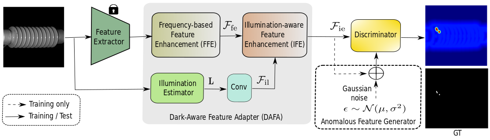

# DarkAD




### Installation 

**Python3.8**

**Packages**:
- torch==1.12.1
- torchvision==0.13.1
- numpy==1.22.4
- opencv-python==4.5.1

### Data

Edit `run.sh` to edit dataset class and dataset path.

Download the dataset from [here](https://www.mvtec.com/company/research/datasets/mvtec-3d-ad).

The dataset folders/files follow its original structure.

### Run

#### Demo train

Please specicy dataset path (line1) and log folder (line10) in `run.sh` before running.

`run.sh` gives the configuration to train models on MVTecAD dataset.
```
bash run.sh
```

