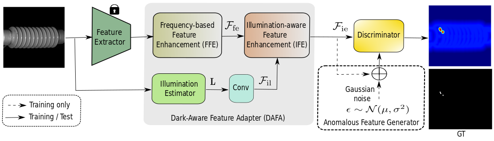

# DarkAD




### Installation 

**Python3.8**

**Packages**:
- torch==1.12.1
- torchvision==0.13.1
- numpy==1.22.4
- opencv-python==4.5.1

### Data

Download the dataset: [MVTec3d](https://www.mvtec.com/company/research/datasets/mvtec-3d-ad), [Insulator](https://github.com/InsulatorData/InsulatorDataSet), and [Clutch](https://owncloud.fraunhofer.de/index.php/s/mtr1FzERutdOrXi).

The dataset folders/files follow its original structure.

### Run

#### Demo train
```
bash run.sh
```

